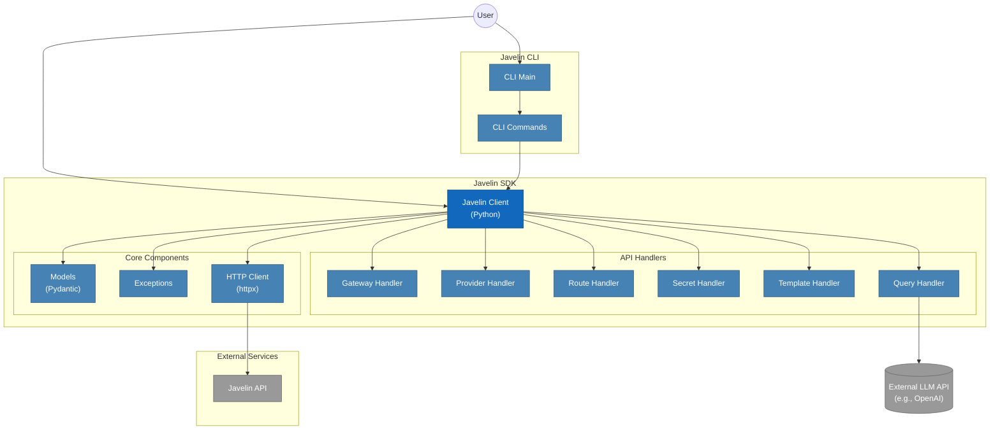

## Javelin: an Enterprise-Scale, Fast LLM Gateway

[](https://github.com/getjavelin/javelin-python/actions/workflows/python-publish.yml)

This is the Python client package for Javelin.

For more information about Javelin, see https://getjavelin.io  
Javelin Documentation: https://docs.getjavelin.io

### Installation

```python
  pip install javelin_sdk
```

### Quick Start

```python
  from javelin_sdk import (
    JavelinClient,
    Route,
    NetworkError,
    RouteNotFoundError,
    UnauthorizedError,
  )

  import os, sys

  try:
       javelin_api_key = os.getenv('JAVELIN_API_KEY')
       llm_api_key = os.getenv("OPENAI_API_KEY")

       client = JavelinClient(base_url="https://api-dev.javelin.live", # Set Javelin's API base URL for query
                              javelin_api_key=javelin_api_key,
                              llm_api_key=llm_api_key)

       print('sucessfully connected to Javelin Client')

  except NetworkError as e:
       print("Failed to create client: Network Error")
       sys.exit()

  # Create a route object
  route_data = {
    "name": "test_route_1",
    "type": "chat",
    "models": [
        {
            "name": "gpt-3.5-turbo",
            "enabled": True,
            "provider": "openai",
            "suffix": "/v1/chat/completions",
        }
    ],
    "config": {
        "archive": True,
        "organization": "myusers",
        "retries": 3,
        "rate_limit": 7,
    },
  }

  route = Route.parse_obj(route_data)
  try:
       client.create_route(route)
  except NetworkError as e:
       print("Failed to create route: Network Error")

  query_data = {
        "model": "gpt-3.5-turbo",
        "messages": [
            {"role": "system", "content": "You are a helpful assistant that translates English to French."},
            {"role": "user", "content": "AI has the power to transform humanity and make the world a better place"},
        ],
        "temperature": 0.8,
    }

   # query the llm
   try:
       response = client.query_route("test_route_1", query_data)
   except RouteNotFoundError as e:
       print("Route Not Found")
```

### System Architecture


